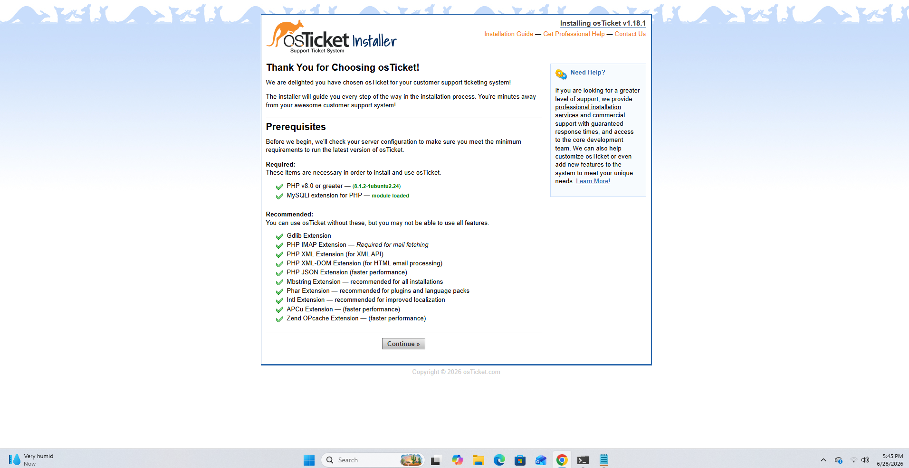
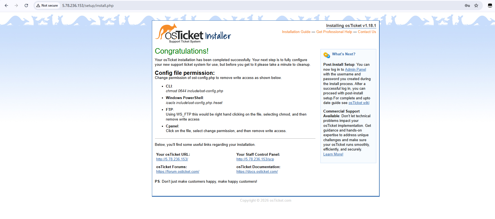
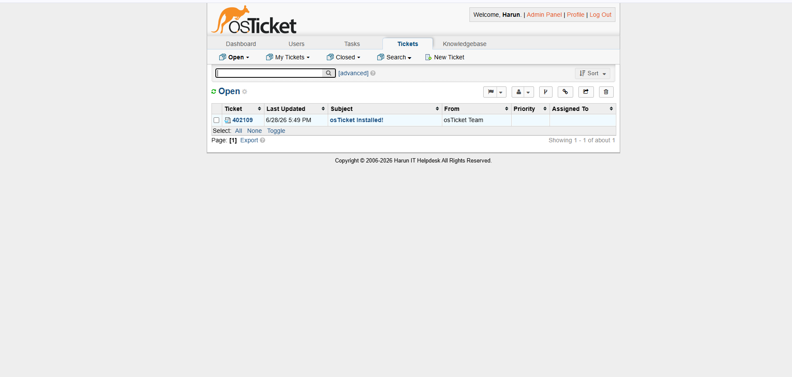
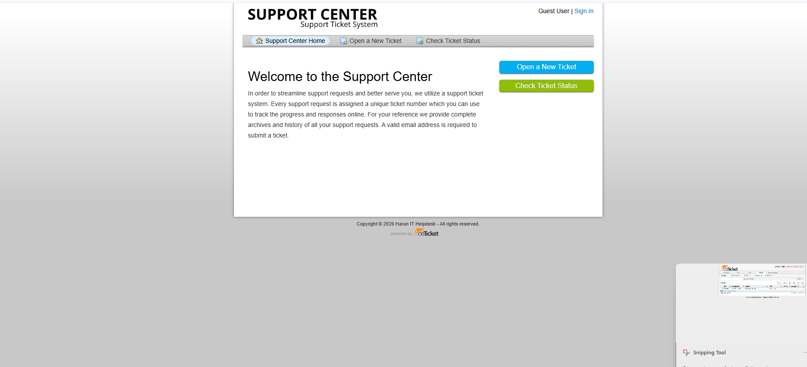
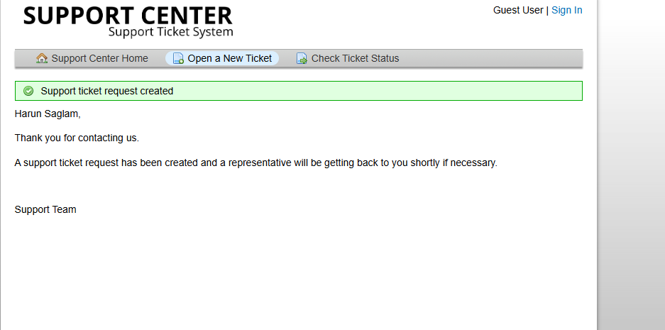
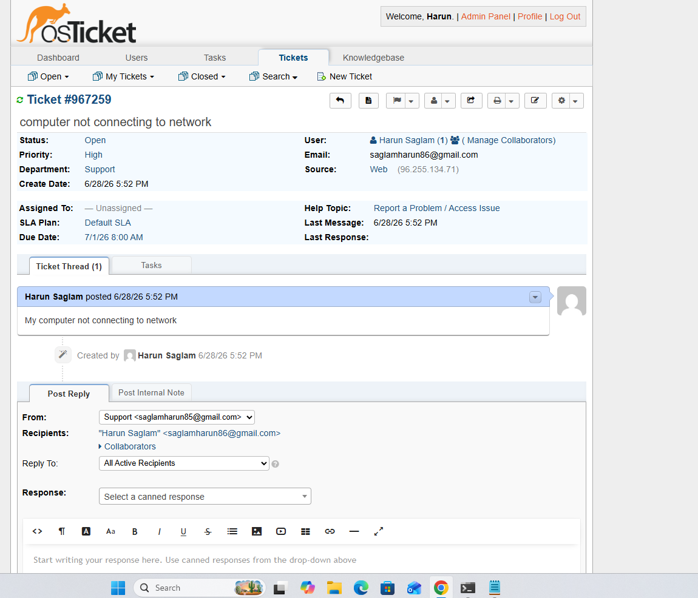
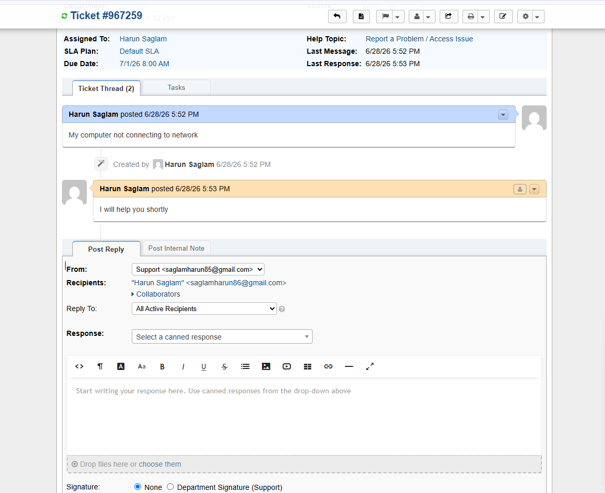

# osTicket Helpdesk Lab

Self-hosted IT helpdesk deployed on Ubuntu 22.04 Linux VPS using osTicket v1.18.1.

## Environment

| Component | Details |
|-----------|---------|
| Server | Hetzner VPS (Ubuntu 22.04) |
| Web Server | Apache2 |
| Database | MySQL |
| Application | osTicket v1.18.1 |
| Live URL | http://5.78.236.153 |

## What Was Built

- Deployed full LAMP stack on Linux VPS from scratch
- Configured MySQL database and user permissions
- Set up Apache virtual host with mod_rewrite
- Completed osTicket web installer and post-install security hardening
- Demonstrated full ticket lifecycle: submit, assign, respond, resolve

## Screenshots

### 1. Installer Prerequisites Check

### 2. Installation Complete

### 3. Admin Ticket Queue

### 4. Ticket Thread with Admin Response

### 5. Ticket Submitted Successfully

### 6. User Portal

### 7. Ticket Detail View

## Skills Demonstrated

- Linux server administration (Ubuntu 22.04)
- Apache2 web server configuration
- MySQL database setup and user permissions
- IT helpdesk administration and ticket management
- SOP adherence and technical documentation
